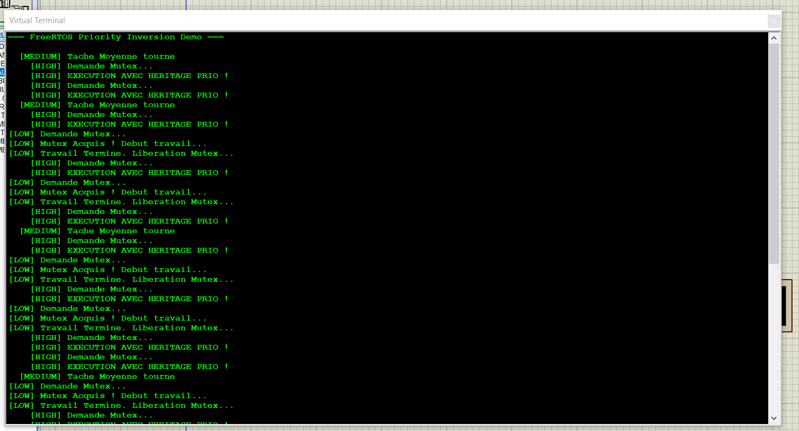

# 🚀 FreeRTOS Priority Inversion & Mutex Demo (ATmega328P)


## 📌 Project Overview
This project implements and experimentally validates the **Priority Inheritance** mechanism under **FreeRTOS** on an 8-bit AVR microcontroller (ATmega328P / Arduino Uno) simulated in Proteus.

The goal is to demonstrate how a FreeRTOS **Mutex** solves the critical **Priority Inversion** problem, a dreaded phenomenon in the design of applied real-time embedded systems.

---

## 🌍 Real-World Applications & Industrial Context

Priority inversion occurs when a high-priority task is indirectly blocked by a medium-priority task. In a critical real-time system (Hard Real-Time), this delay can cause a loss of control or a crash.

### 1. The Historical Case: Mars Pathfinder (1997) 🔴
NASA's Mars mission nearly failed completely due to a priority inversion on the VxWorks real-time OS:
- **Low-priority task (Weather):** Acquired a shared data bus.
- **High-priority task (Information Management):** Needed to read this bus before resetting the watchdog timer.
- **Medium-priority task (Communications):** Preempted the weather task, preventing the high-priority task from accessing the bus.
- **Result:** The watchdog timer expired and the rover kept restarting.
- **Remote fix applied:** Enabling the **Priority Inheritance** mechanism on the bus Mutex.

### 2. Modern Industrial Use Cases 🛠️
- **Automotive (ADAS / ABS Braking Systems):** Ensuring an emergency braking sensor (`High Priority`) immediately accesses the CAN bus even if a telemetry computation (`Low Priority`) holds the resource.
- **Aeronautics & Avionics:** Preventing secondary data streams from interrupting flight control loops.
- **Medical Devices (Ventilators, Syringe Pumps):** Ensuring vital alarms preempt touchscreen display routines.

---

## 🛠️ Software Architecture & Demonstration

The system consists of three concurrent tasks sharing a single Mutex (`xResourceMutex`):

| Task | Priority | Role |
| :--- | :---: | :--- |
| **`vTaskLow`** | `1` (Low) | Locks the Mutex and performs a long computation (Critical Section). |
| **`vTaskMedium`** | `2` (Medium) | Independent periodic task (does not request the Mutex). |
| **`vTaskHigh`** | `3` (High) | High-priority task requesting the Mutex held by `vTaskLow`. |

### 🔄 The Priority Inheritance Mechanism in Action
1. `vTaskLow` acquires the Mutex and starts its work.
2. `vTaskHigh` wakes up and requests the Mutex → Blocked, as it is unavailable.
3. **FreeRTOS action:** `vTaskLow`'s priority is automatically and temporarily **boosted to level 3**.
4. `vTaskMedium` (Priority 2) can no longer preempt `vTaskLow`.
5. `vTaskLow` releases the Mutex → Its priority returns to `1`, and `vTaskHigh` immediately takes over.

---

## 💻 Experimental Validation (Virtual Terminal)



### Timeline of observed logs:
```text
=== FreeRTOS Priority Inversion Demo ===

[LOW] Requesting Mutex...
[LOW] Mutex Acquired! Starting work...
[LOW] Work Finished. Releasing Mutex...
    [HIGH] Requesting Mutex...
    [HIGH] EXECUTING WITH INHERITED PRIORITY!
  [MEDIUM] Medium task running
```
